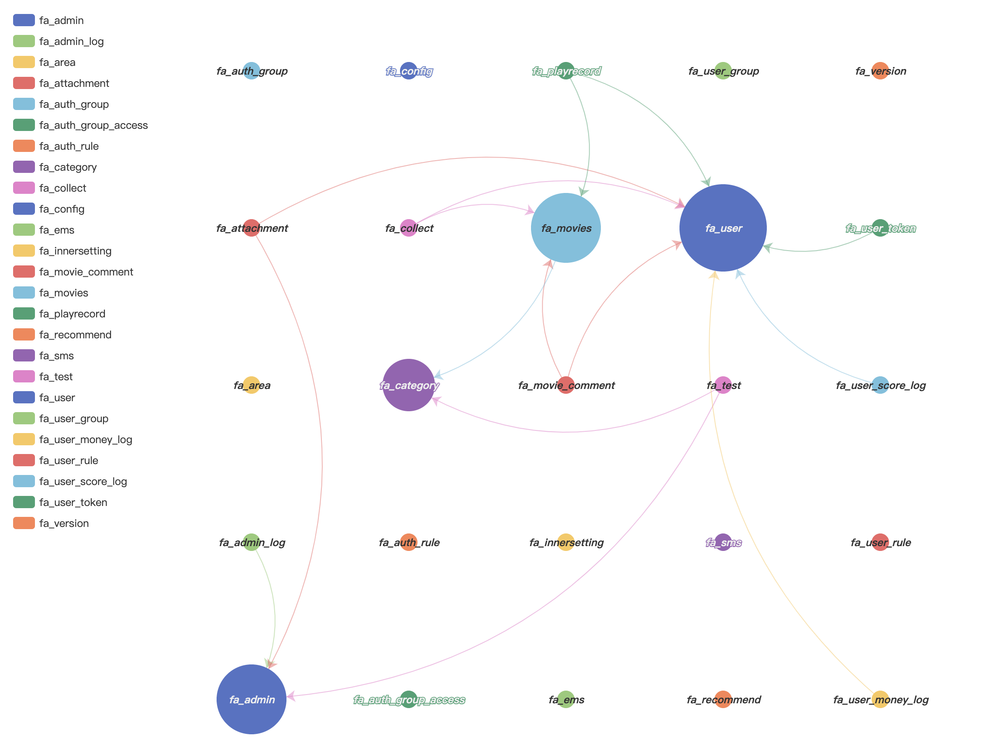
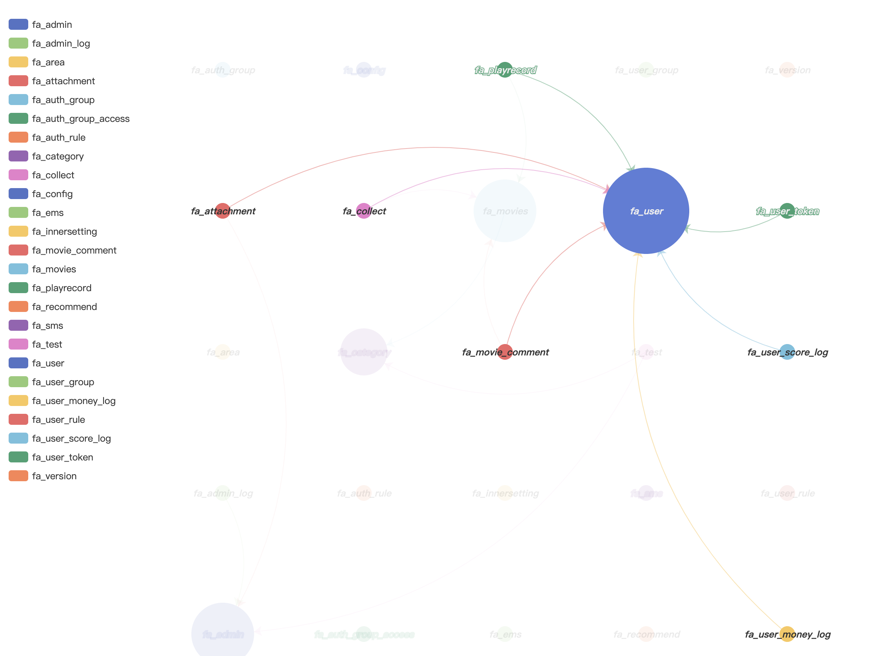
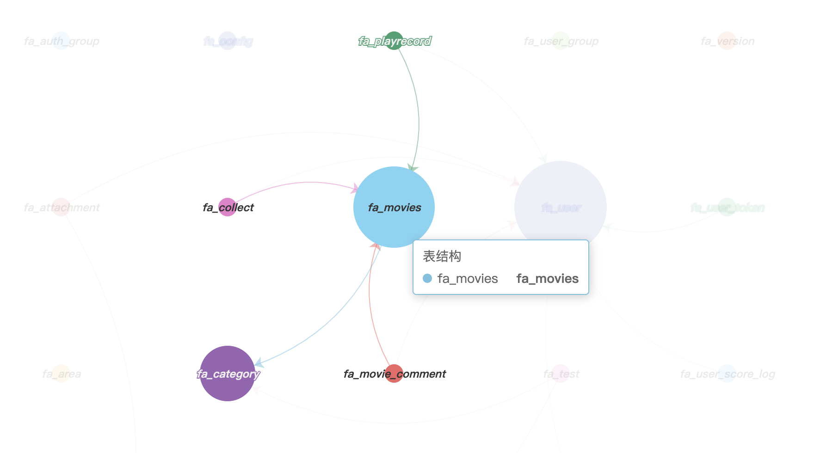

# sqlcharts 自动生成数据库关联关系图

- 复制settings.py.example 重命名为settings.py
- 将数据库配置信息填入settings.DATABASE，目前支持mysql和postgresql
- 执行 python build.py -b，-b是读取数据库表结构，如果只更新匹配规则，可以去掉-b
- 当前目录执行 python -m http.server --cgi 8801
- 本地访问 127.0.0.1:8801/dist 可看到效果
- mysql需要安装pymysql依赖
  - pip3 install pymysql
- postgresql 需要安装 psycopg2 依赖 mac 安装如下
  - brew install postgresql 
  - pip3 install Psycopg2

### 示例图
#### 首次进入

#### 选中左边栏

#### 选中图标

- 有兴趣的朋友可以关注下我的公众号，公众号里有我对这个项目的初衷和心路历程
- https://mp.weixin.qq.com/s/deMhtLThftAfpz4o8A8tTA

# sqlcharts 全新改版
- 显示模式修改为er图模式，之前的模式只显示表名，现在所有字段全都显示，更容易看到表字段之间的关联
- 修复了-b的匹配问题，读库和匹配拆分的更加明确

# 项目流程简述
- 读取数据库表结构和字段，生成sql_data.json
- python build.py -b 读取sql_data,根据自定义匹配模式和默认模式，自动生成带关联的er图json
- python -m http.server --cgi 8801 本地访问 127.0.0.1:8801/dist 可看到效果